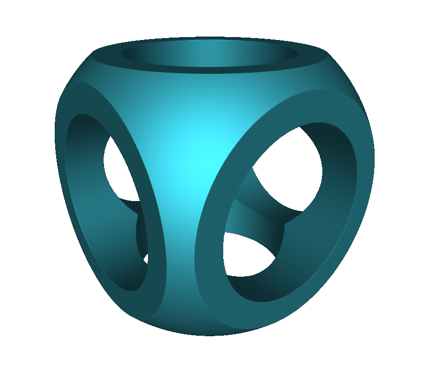

# SDFcad

This is a pretty early work in progress! There's still a lot of work to be done, features to be added, and things to clean up. I'll be refining it over time.

Special thanks to [Sebastian Lague's Coding Adventure](https://youtu.be/Cp5WWtMoeKg) and [Michael Fogleman](https://github.com/fogleman/sdf/) for a lot of the inspiration for this program. Also thanks to [Inigo Quilez] for documentating the implementation for a large variety of signed distance functions.

# Example



Similar to [Inigo Quilez], here's the same example implemented with this SDF library.

```C++

SDF3 Object;

void ConstructSignedDistance()
{
    SDF3 cylinder = Cylinder(2, 0.5);
    SDF3 cylinderX = Rotate(cylinder, TO_RAD(90), vec3(1,0,0));
    SDF3 cylinderZ = Rotate(cylinder, TO_RAD(90), vec3(0,0,1)); 

    Object = (Sphere(1) & Cube(1.5)) - (cylinder + cylinderX + cylinderZ);
}

void DestructSignedDistance()
{
}

float SignedDistance(vec3 pos)
{
    return Object(pos);
}

```

# How it works

Objects are first initialized in the function ConstructSignedDistance. This is so that the initialization only needs to happen once and makes the calls to SignedDistance faster.

SDF objects can be called with vec3 as a parameter to evaluate the signed distance function at that coordinate. In this example, all that needs to be done is to call Object with the position argument.

## Operations

Operator(s) | Action
-|-
a+b <br> a\|b | Union of two objects. Encapsulates the Union() function.
a-b | Difference between two objects. Encapsulates the Difference() function.
a&b | Intersection between two objects. Encapsulates the Intersection() function.

## Under the hood

SDF3 objects are just containers for the underlying _SDF objects. They handle the overloaded operators and memory management. 

Functions are used to abstract away and simplify the object creation. All objects like spheres and boxes inherit from the _SDF class. This allows them to be referenced polymorphically from the SDF object containing it.

```C++
//== Object Wrappers ==
SDF3 Sphere(float radius);
SDF3 SphereD(float diameter);
SDF3 Box(vec3 size);
SDF3 Cube(float size);
SDF3 Cylinder(float height, float radius);

//== Modifier Wrappers ==
SDF3 Translate(SDF3 object, vec3 move);
SDF3 Union(SDF3 object1, SDF3 object2);
SDF3 Difference(SDF3 object1, SDF3 object2);
SDF3 Intersect(SDF3 object1, SDF3 object2);
SDF3 Transform(SDF3 object, mat4 matrix);
SDF3 Rotate(SDF3 object, float angle, vec3 axis);
```

Each time an object is created, a new _SDF object is allocated and contained within an SDF object. _SDF objects are passed around by reference which minimizes the amount of times memory has to be allocated and freed. To enable this, each _SDF one keeps track of their reference count. When a SDF object obtains an _SDF object, it increments the reference counter. When it is destroyed, it decrements the reference counter. If the reference counter of an _SDF object reaches zero, it is freed.

```C++
//Handles reference tracking and automatic freeing
void SDF3::ObjectDecr()
{
    if (Object)
    {
        Object->ReferenceCount--;
        if (Object->ReferenceCount==0)
        {
            delete Object;
        }
    }
    Object = 0;
}
```

Operations also inherit from the _SDF class and are likewise stored in the SDF containers. This enables a simple interface where operations can be intuitively used and chained together following the regular order of operations. The difference is that Operations often store one or more other SDF container within it. This allows them to apply the appropriate transformations/calculations to each object when being evaluated.

<br>

From the above example, a new SDFCylinder object is allocated and stored within the cylinder variable. The Rotate function creates a SDFRotate object which stores a reference to the original cylinder, along with the transformation matrix. Therefore the creation of the cylinderX and cylinderZ objects only allocate 2 new SDFRotate objects, with the original cylinder being referenced in 3 places.

The final statement creates a new SDFSphere and SDFBox object, as well as a SDFIntersection object to operate on them. SDFDifference and SDFUnion objects are also then created for the following operations.

<br>

The overloaded "()" operator can be used to evaluate the SDF object at a given coordinate. The SDF object then calls the _SDF object it contains which preforms the calculation. A variety of basic objects and transformations have already been implemented, but more could be easily added. 

```C++
//Evaluates the Signed Distance Function for a given point
float SDF::operator()(vec3 pos)
{
    return (*Object)(pos);
}
```

For example, objects like SDFSphere just calculate their Signed Difference Function with the given coordinate. Operators like SDFTranslate work by changing the coordinate before calling the object it contains. Operators like SDFUnion instead work by operating on the value returned by it's objects (taking the min in this case).

```C++
//Example snippets:
float SDFUnion::operator()(vec3 pos)
{
    return SdfUnion((*Object1.Object)(pos), (*Object2.Object)(pos));
}
float SDFTransform::operator()(vec3 pos)
{
    return (*Object.Object)(SdfTransform(pos, TransformMat));
}
float SDFSphere::operator()(vec3 pos)
{
    return SdfSphere(pos, Radius);
}
```

Internally, the objects call their corresponding Sdf functions, which are also exposed if you want to use them directly.

```C++
//== Objects ==
float SdfSphere(vec3 pos, float radius);
float SdfRoundBox(vec3 pos, vec3 size, float radius);
float SdfBox(vec3 pos, vec3 size);
float SdfCylinder(vec3 pos, float height, float radius);

//== Modifiers ==
float SdfUnion(float d0, float d1);
float SdfDifference(float d0, float d1);
float SdfIntersect(float d0, float d1);
vec3 SdfTranslate(vec3 pos, vec3 move);
vec3 SdfTransform(vec3 pos, mat4 matrix);
```


<br>

This all allows for manipulating objects intuitively. Otherwise, transformations would have to be applied to the coordinates instead of objects themselves like this:
```C++
float SignedDistance(vec3 pos)
{
    //Translate 1 unit to the right
    vec3 translatedPos = pos - vec3(1,0,0);
    //Create the sphere at this location
    return SdfSphere(translatedPos);
}
```

# SDFviewer

A simple Mesh Viewer for the SDFcad implementation.


# MeshExporter

A command line for generating the mesh and exporting to an .stl file.


[Inigo Quilez]: https://iquilezles.org/www/articles/distfunctions/distfunctions.htm

